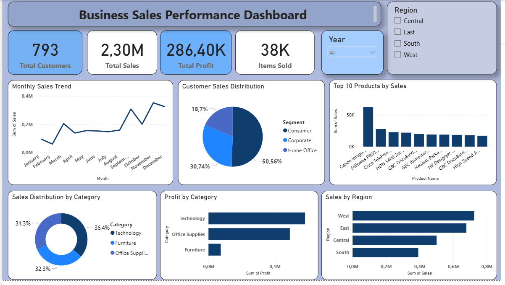

# 📊 Sales Performance Analysis (SQL & Power BI)

 ## 📌 Overview
This project demonstrates the end-to-end analysis of retail sales data, combining SQL for data extraction and Power BI for visualization to support business decision-making.

## 📊 Dashboard Preview

## 🎯 Business Questions
- Which regions generate the most sales?
- Which categories are the most profitable?
- What are the top-selling products?
- How do sales change over time?
- Which customer segments drive the most revenue?

## 📈 Key Insights
- The Central region is the top revenue contributor, while the South shows growth potential  
- Technology is the leading revenue-driving category  
- Furniture generates strong sales but operates at a loss, indicating margin issues  
- September is the peak sales month, suggesting seasonal trends  
- The Consumer segment contributes the highest share of total sales  

## 🛠 Tools Used
- MySQL
- SQL (Aggregation, Grouping, Data Cleaning)

## 📂 Files
- `sales_analysis.sql` → SQL queries used for analysis
